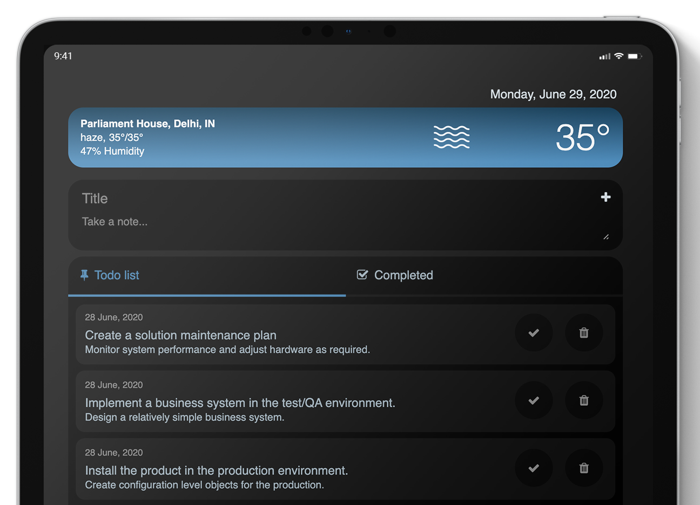

# Todobox
> Keep track of your daily activities.
Wether it's for work, side project or family vocation,
TodoBox made using flask

Browse this project on [Heroku](https://todoboxcs50.herokuapp.com/)

Requirements
============
The python dependencies are managed using pip and listed in
`requirements.txt`

Setting up Local Development
============================

First, clone this repository:

    $ git clone https://github.com/bas1r/todobox.git

You can use pip to install the requirements:

    $ pip install -r requirements.txt

Switch Flask to the development environment:

	$ export FLASK_ENV=development

Set environment variables:

    $ export SECRET_KEY="Unique Secret Key"

If you wish to activate forget password:

    $ export MAIL_USERNAME="example@gmail.com"
    $ export MAIL_PASSWORD="example"

Start the server by running:

	$ python3 run.py

Browse to [localhost](http://127.0.0.1:5000) for the index page

The weather data is provided by [OpenWeatherMap](https://openweathermap.org/)
To display weather information, get an API key and place it in App/static/weather.js:

    21    // Place your API key
    22    'appid=apikey',

